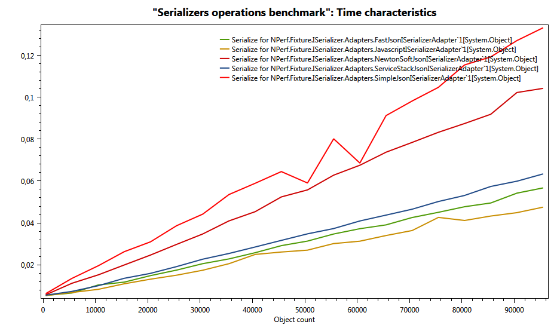
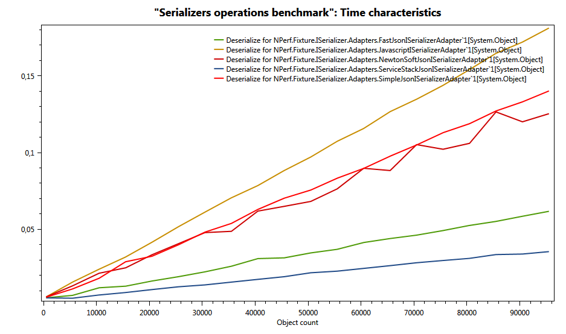
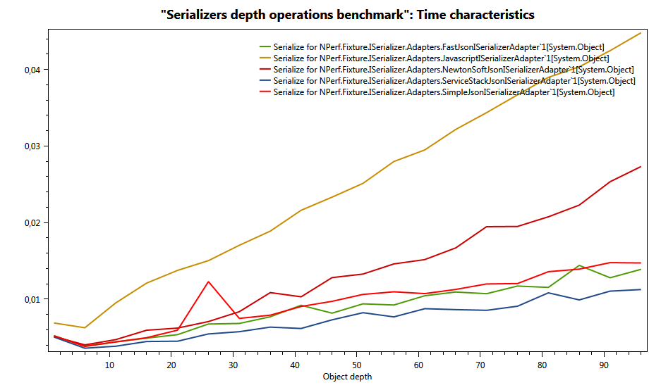
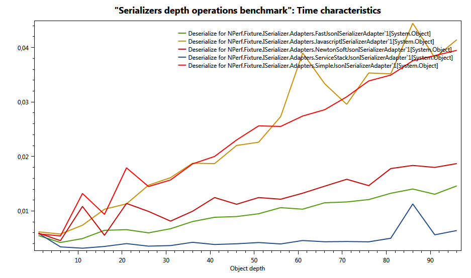
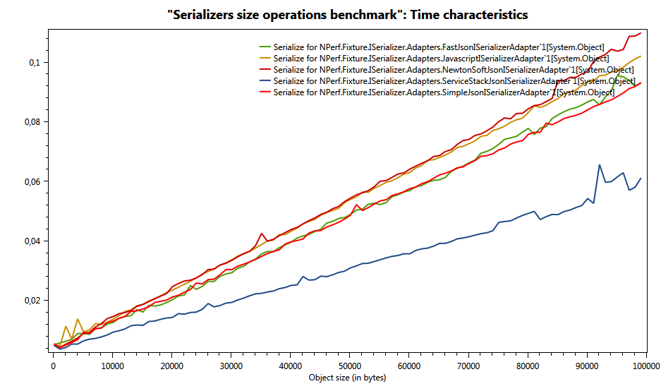
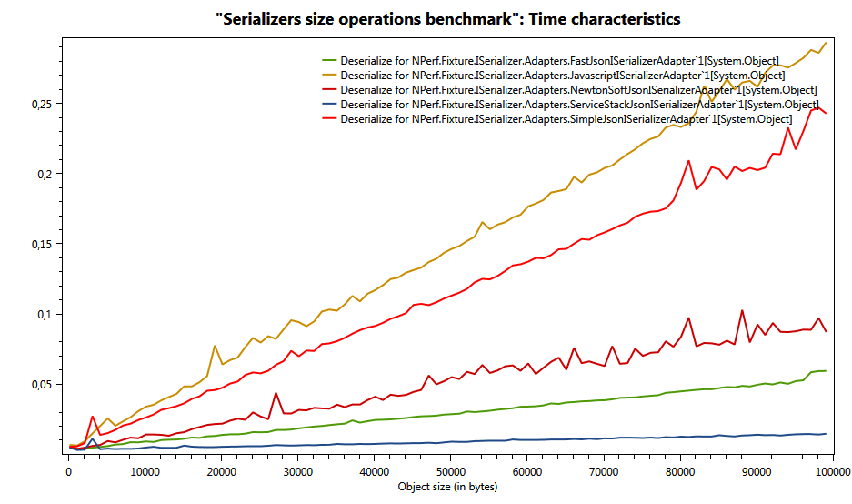

NPerf ISerializer fixture documentation
=======================================

*Comparing .NET serializers time and memory complexity using NPerf Framework*


Abstract
========
The aim of this article is to compare the performance of several serialization algorithms for the .NET framework. In order to do so, we used the NPerf, a framework to run performance tests for any implementations of a given target interface.

Serialization is a very important process on the web API’s, because it transforms all the returned objects into strings that can travel over the wire to the client programs. So it is important it is as fast as possible, as long as it has a direct impact on the time the web application spends to respond a request.


Introduction
============

Wikipedia defines serialization as follows:

“In computer science, in the context of data storage and transmission, serialization is the process of translating data structures or object state into a format that can be stored (for example, in a file or memory buffer, or transmitted across a network connection link) and resurrected later in the same or another computer environment”.

In other words, serialization/deserialization is the process of moving an object from one computer process to another. This process is needed because each process in execution has its own memory space, so the an object on the memory space of a process has references (pointers) to other zones of memory that may not be valid in on the memory space of another process.

This way, serializing an object implies flattening it, remove all the memory references and substitute them by what is referenced. This operation involves traversing the object graph, all the attributes recursively, and getting the values to build a flatten representation of it, for example, in a string.


The fixture
===========

The target interface: ISerializer
---------------------------------
We created a simple target interface for serialization and deserialization using generics.

```C#
public interface ISerializer<T>
    {
        string Serialize(T theObject);

        T Deserialize(string serialized);
    }
```


The tested serializers
----------------------

These are the serializers we compared and their websites:
+ .NET JavaScriptSerializer
    + http://msdn.microsoft.com/library/system.web.script.serialization.javascriptserializer.aspx
+ FastJson Serializer
    + http://fastjson.codeplex.com/
+ NewtonSoft Json Serializer
    + http://json.codeplex.com/
+ ServiceStack Json Serializer
    + http://www.servicestack.net/docs/text-serializers/json-serializer
+ Simple Json Serializer
    + https://github.com/facebook-csharp-sdk/simple-json


Adapting the serializers to implement ISerializer interface
-----------------------------------------------------------

As long as there is not an ISerializer interface in the .NET framework, so the serializers do not implement a common interface, we created a simple interface for a serializer we called ISerializer and we coded some adapter clases. These clases implement ISerializer interface using each of the algorithms to be tested.

For example, the class NewtonSoftJsonISerializerAdapter implements ISerializer<T> interface using NewtonSoft Json package.

```C#
    using Newtonsoft.Json;

    public class NewtonSoftJsonISerializerAdapter<T> : ISerializer<T>
    {
        public NewtonSoftJsonISerializerAdapter()
        {            
        }
        public string Serialize(T theObject)
        {
            return JsonConvert.SerializeObject(theObject);
        }
        public T Deserialize(string serialized)
        {
            return JsonConvert.DeserializeObject<T>(serialized);
        }
    }
```

This way, we could create an NPerf fixture for all the serializers targeting ISerializer interface they implement through the adapter classes.

It is important to remark that the adapter classes do not introduce any considerable overhead, only a method call, but it is the same for all of the serializers.


The performance test clases
---------------------------

We compared the serializers using three variables:
+ The number of objects to serialize/deserialize.
+ The depth of the objects to serialize/deserialize.
+ The size in memory of the objects to serialize/deserialize.

We define the depth of an object recursively this way:

1. An object has depth 0 if it is a string or a value type.
2. An object has depth 1 if all of its attributes are strings or value types: numeric values, structs, enumerations or booleans.
3. An object has depth N+1 if the maximum depth of its attributes is N.


### Serializers performance varying the number of objects to serialize/deserialize

#### The NPerf fixture class:
```C#
    [PerfTester(
       typeof(ISerializer<object>),
       20,
       Description = "Serializers operations benchmark",
       FeatureDescription = "Object count")]
    public class ISerializerPerfs
    {
      ...
    }
```

#### The setup method:
```C#
        [PerfSetUp]
        public void SetUp(int testIndex, ISerializer<Object> serializer)
        {
            this.count = this.CollectionCount(testIndex);
            objects = new List<Object>();
            serialized = new List<String>();

            for (var i = 0; i < this.count; i++)
            {
                objects.Add(i);
                serialized.Add(serializer.Serialize(i));
            }
        }
```

#### The serialize test method:
```C#
        [PerfTest]
        public void Serialize(ISerializer<Object> serializer)
        {
            for (var i = 0; i < this.count; i++)
            {
                serializer.Serialize(objects[i]);
            }
        }
```

#### The deserialize test method:
```C#
        [PerfTest]
        public void Deserialize(ISerializer<Object> serializer)
        {
            for (var i = 0; i < this.count; i++)
            {
                serializer.Deserialize(serialized[i]);
            }
        }
```



### Serializers performance varying the depth of the objects to serialize/deserialize

#### The NPerf fixture class:
```C#
    [PerfTester(
       typeof(ISerializer<object>),
       20,
       Description = "Serializers depth operations benchmark",
       FeatureDescription = "Object depth")]
    public class ISerializerDepthPerfs
    {
      ...
    }
```

#### The setup method:
```C#
        [PerfSetUp]
        public void SetUp(int testIndex, ISerializer<Object> serializer)
        {
            this.count = this.CollectionCount(testIndex);
            objects = new List<Object>();
            serialized = new List<String>();

            for (var i = 0; i < 10; i++)
            {
                var tmp = ObjectRandomizerHelper.RandomObjectOfDepth(this.count);
                objects.Add(tmp);
                serialized.Add(serializer.Serialize(tmp));
            }
        }
```

✦ In order to generate random objects with the given depth we user this helper method:

```C#
        public static object RandomObjectOfDepth(int depth)
        {
            if (depth == 0)
            {
                return RandomSimpleObject();
            }

            var obj = (RandomObjectClass)RandomSimpleObject();
            var tmp = (RandomObjectClass)RandomObjectOfDepth(depth - 1);
            obj.TheObject = tmp;

            return obj;
        }
        

        public static object RandomSimpleObject()
        {
            var obj = new RandomObjectClass
                {
                    TheInteger = r.Next(),
                    TheString = new string(Enumerable.Repeat(chars, 8).Select(s => s[r.Next(s.Length)]).ToArray()),
                    TheIntArray = new int[ARRAY_SIZE],
                    TheObject = null
                };
            for (var i = 0; i < ARRAY_SIZE; i++)
            {
                obj.TheIntArray[i] = r.Next();
            }

            return obj;
        }
```


#### The serialize test method:
```C#
        [PerfTest]
        public void Serialize(ISerializer<Object> serializer)
        {
            foreach (var t in this.objects)
            {
                serializer.Serialize(t);
            }
        }
```


#### The deserialize test method:
```C#
        [PerfTest]
        public void Deserialize(ISerializer<Object> serializer)
        {
            foreach (var s in this.serialized)
            {
                serializer.Deserialize(s);
            }
        }
```

### Serializers performance varying the size of the objects to serialize/deserialize

#### The NPerf fixture class:
```C#
    [PerfTester(
       typeof(ISerializer<object>),
       20,
       Description = "Serializers size operations benchmark",
       FeatureDescription = "Object size (in bytes)")]
    public class ISerializerSizePerfs
    {
      ...
    }
```

#### The setup method:
```C#
        [PerfSetUp]
        public void SetUp(int testIndex, ISerializer<Object> serializer)
        {
            this.count = this.CollectionCount(testIndex);
            objects = new List<Object>();
            serialized = new List<String>();

            for (var i = 0; i < 10; i++)
            {
                var tmp = ObjectRandomizerHelper.RandomObjectOfSize(this.count);
                objects.Add(tmp);
                serialized.Add(serializer.Serialize(tmp));
            }
        }
```

✦ In order to generate random objects with the given size we user this helper method:

```C#
public static object RandomObjectOfSize(int sizeInBytes)
        {
            var obj = new RandomObjectClass();
            obj.TheInteger = r.Next();
            obj.TheObject = null;

            var halfSize = (sizeInBytes - sizeof(int)) / 2;
            var intCount = halfSize / sizeof(int);
            var stringCount = halfSize / sizeof(char);

            obj.TheString = new string(Enumerable.Repeat(chars, stringCount).Select(s => s[r.Next(s.Length)]).ToArray());
            
            obj.TheIntArray = new int[intCount];
            for (var i = 0; i < intCount; i++)
            {
                obj.TheIntArray[i] = r.Next();
            }

            return obj;
        }
```

#### The serialize test method:
```C#
        [PerfTest]
        public void Serialize(ISerializer<Object> serializer)
        {
            foreach (var t in this.objects)
            {
                serializer.Serialize(t);
            }
        }
```


#### The deserialize test method:
```C#
        [PerfTest]
        public void Deserialize(ISerializer<Object> serializer)
        {
            foreach (var s in this.serialized)
            {
                serializer.Deserialize(s);
            }
        }
```


Empirical performance analysis results
======================================

The execution environment
-------------------------

The performance tests were executed in a computer with the following features:

| FEATURE | VALUE |
| --------|-------|
| **Processor model** | Intel Core 2 Duo T5800 |
| **Processor frequency** | 2 GHz |
| **Processor L2 cache** | 2 MB |
| **Main memory type** | DDR2 - PC2-6400 (SO-DIMM) |
| **Main memory size** | 4 GB |
| **Main memory speed** | 800 MHz |
| **Operating system** | Microsoft Windows 7 Professional |
| **OS version** | 6.1.7601 Service Pack 1 |
| **.NET framework version** | 4.5 |


## Serializers performance results varying the number of objects to serialize/deserialize

### Test: Serialize - All algorithms - Time complexity

+ .NET JavaScriptSerializer was the fastest serializing N objects, followed by FastJson and ServiceStack serializers.
+ All the tested serializers have linear time complexity serializing N objects.

### Test: Deserialize - All algorithms - Time complexity

+ The faster deserializer was ServiceStack, followed by FastJSON (about 2 times slower).
+ The rest were about 3-4 times slower than ServiceStack implementation.
+ All the algorithms have linear time complexity deserializing N objects.


## Serializers performance results varying the depth of the objects to serialize/deserialize

### Test: Serialize - All algorithms - Time complexity

+ The faster serializer was ServiceStack, followed by FastJSON and SimpleJSON (about 1.5 times slower).
+ The slowest serializer was JavaScriptSerializer by a great difference.
+ All the algorithms have linear time complexity varying the object depth.

### Test: Deserialize - All algorithms - Time complexity

+ The faster deserializer was ServiceStack, followed by FastJSON and NewtonSoft(about 4 times slower).
+ The slowest deserializers were JavaScriptSerializer and SimpleJSON by a great difference.
+ All the algorithms have linear time complexity varying the object depth.


## Serializers performance varying the size of the objects to serialize/deserialize

### Test: Serialize - All algorithms - Time complexity

+ The faster serializer was ServiceStack by a great difference with the rest.
+ The slowest serializer was JavaScriptSerializer and NewtonSoftJsonSerializer.
+ All the algorithms have linear time complexity varying the object size.

### Test: Deserialize - All algorithms - Time complexity

+ The faster deserializer was ServiceStack, followed by FastJSON and NewtonSoftJson (about 5 times slower).
+ The slowest deserializer was JavaScriptSerializer by a great difference.
+ All the algorithms have linear time complexity varying the object size.


Conclusions
===========

Global rank
-----------

| | FastJSON | Javascript | NewtonSoft | **ServiceStack** | SimpleJSON |
|---|:---:|:---:|:---:|:---:|:---:|
| Serialize N Objects | 2 | 1 | 4 | 3 | 5 |
| Deserialize N Objects | 2 | 5 | 3 | 1 | 4 |
| Serialize Object depth | 2 | 5 | 4 | 1 | 3 |
| DeserializeObject depth | 2 | 5 | 3 | 1 | 4 |
| Serialize Object size | 3 | 4 | 5 | 1 | 2 |
| Deserialize Object size | 2 | 5 | 3 | 1 | 4 |
| | 2nd | 5th | 3rd | **1st** | 4th | 

+ ServiceStack is the fastest serializer and deserializer globally.
+ JavaScriptSerializer is the slowest serializer and deserializer globally.


Weighted rank
-------------

| | FastJSON | Javascript | NewtonSoft | **ServiceStack** | SimpleJSON
|---|:---:|:---:|:---:|:---:|:---:|
| Serialize N Objects | 1.25x | 1x | 2.5x | 1.5x | 3.25x |
| Deserialize N Objects | 2x | 6x | 4x | 1x | 5x |
| Serialize Object depth | 1.5x | 4.5x | 2.5x | 1x | 1.5x |
| Deserialize Object depth | 3x | 8x | 4x | 1x | 8x |
| Serialize Object size | 1.5x | 1.7x | 2x | 1x | 1.5x |
| Deserialize Object size | 5x | 29x | 8x | 1x | 23x |
| *AVERAGE* | 2.4x | 8.4x | 3.8x | **1.1x** | 7x |

+ ServiceStack is about 3 times faster in average than FastJSON and NewtonSoft serializers.
+ ServiceStack is about 8 times faster in average than SimpleJSON and JavaScriptSerializer serializers.


References
==========

+ http://www.servicestack.net/mythz_blog/?p=344
+ http://www.servicestack.net/benchmarks/
+ http://blogs.msdn.com/b/youssefm/archive/2009/07/10/comparing-the-performance-of-net-serializers.aspx
+ http://james.newtonking.com/archive/2013/04/25/json-net-5-0-release-4-performance
+ http://sergeytihon.wordpress.com/2013/05/12/json-net-vs-servicestack-text/
